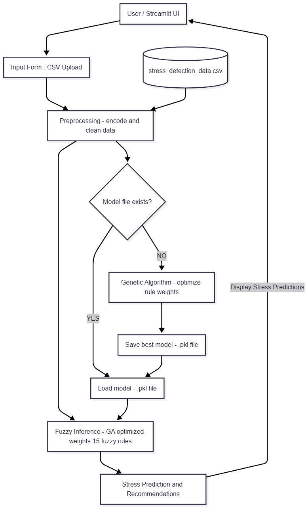

# Adaptive Stress Prediction System

A ML application that predicts stress levels using **Fuzzy Logic Controlled Genetic Algorithms (FLCGA)**.

## 🎥 Demo Video

[](https://youtu.be/y2426gE7SqQ)


## 📋 Overview

This system combines:
- **Fuzzy Logic**: Handles uncertainty in lifestyle and health data
- **Genetic Algorithms**: Optimizes fuzzy rule weights for maximum accuracy
- **Real-time Prediction**: Instant stress assessment from user inputs

## Project Structure

```
adaptive-stress-prediction-using-fcga/
│
├── app.py                      # Streamlit UI 
│
├── src/                         
│   ├── __init__.py             # Makes src a package
│   ├── fuzzy_logic.py          # Fuzzy logic system
│   └── genetic_algorithm.py    # GA optimizer
│
├── data/                        # Dataset
│   └── stress_detection_data.csv
│
├── models/                      # Auto-created for saved models
│   └── fuzzy_ga_model.pkl
│
├── requirements.txt             # Dependencies
└── README.md                   
```

## 🚀 Installation

### Prerequisites
- Python 3.8 or higher
- pip package manager

### Setup Steps

1. **Clone/Download the project**
   ```bash
   cd stress-prediction
   ```

2. **Create virtual environment (recommended)**
   ```bash
   python -m venv venv
   
   # Windows
   venv\Scripts\activate
   
   # Mac/Linux
   source venv/bin/activate
   ```

3. **Install dependencies**
   ```bash
   pip install -r requirements.txt
   ```

4. **Create project structure**
   ```bash
   # Create folders
   mkdir src data models
   
   # Move files to appropriate folders
   # Place fuzzy_logic.py and genetic_algorithm.py in src/
   # Place stress_detection_data.csv in data/
   # Keep main.py in root
   ```

5. **Create __init__.py in src folder**
   ```bash
   # Windows
   type nul > src/__init__.py
   
   # Mac/Linux
   touch src/__init__.py
   ```

## ▶️ Running the Application

```bash
streamlit run main.py
```

The application will open automatically in your browser at `http://localhost:8501`

## 💡 Usage

### 1. Real-time Prediction
- Navigate to **"Predict Stress"** tab
- Enter your lifestyle information (sleep, work, health metrics, etc.)
- Click **"Predict Stress Level"**
- View results and personalized recommendations

### 2. Batch Prediction
- Navigate to **"Batch Prediction"** tab
- Upload a CSV file with multiple records
- Download results with predictions

### 3. Model Training
- First run: Model trains automatically (takes ~2-3 minutes)
- Model is saved in `models/` directory
- Click **"Retrain Model"** in sidebar to optimize again

## 🧬 How It Works

## 🧩 Workflow Diagram




### Fuzzy Logic
- Converts crisp inputs (e.g., 7 hours sleep) to fuzzy sets (Low, Medium, High)
- Applies 15 fuzzy rules based on lifestyle factors
- Handles uncertainty naturally

### Genetic Algorithm
- **Population**: 100 individuals (weight vectors)
- **Generations**: 50 iterations
- **Selection**: Tournament selection
- **Crossover**: Uniform crossover (80% rate)
- **Mutation**: Gaussian mutation (10% rate)
- **Fitness**: Prediction accuracy on training data

### Features Used
- Sleep duration & quality
- Work hours & travel time
- Physical activity & exercise
- Screen time & social interactions
- Health metrics (BP, cholesterol, blood sugar)
- Lifestyle habits (caffeine, alcohol, smoking)
- Wellness practices (meditation)


## 🛠️ Troubleshooting

**Issue**: Module not found
```bash
pip install -r requirements.txt --upgrade
```

**Issue**: Port already in use
```bash
streamlit run app.py --server.port 8502
```

**Possible Issue**: Model training is slow
- Reduce population size or generations in `genetic_algorithm.py`
- The model is saved after first training

## 📝 Notes

- This is a demonstration project for educational purposes
- Dataset appears synthetically generated - results may not reflect real-world accuracy
- For production use, collect real clinical data and validate thoroughly

## 🔧 Customization

### Modify GA Parameters
Edit `genetic_algorithm.py`:
```python
pop_size=100        # Population size
generations=50     # Num of generations
mutation_rate=0.1  # Mutation probability
```

### Add More Fuzzy Rules
Edit `fuzzy_logic.py` in the `apply_fuzzy_rules()` method

### Change UI Theme
Edit `app.py` custom CSS section

## 📄 License

MIT License

## 👥 Author

Gaurav Tarate

---

